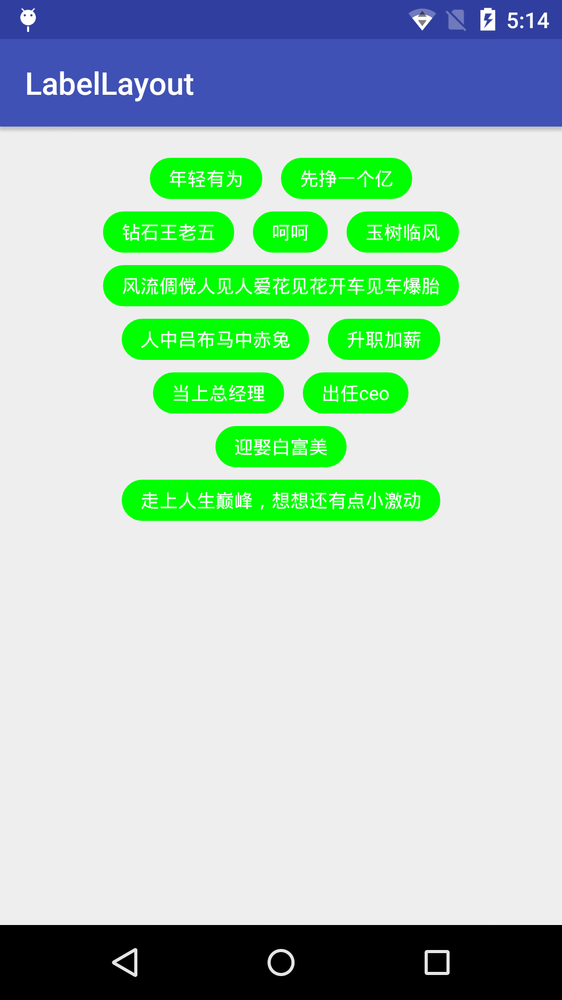
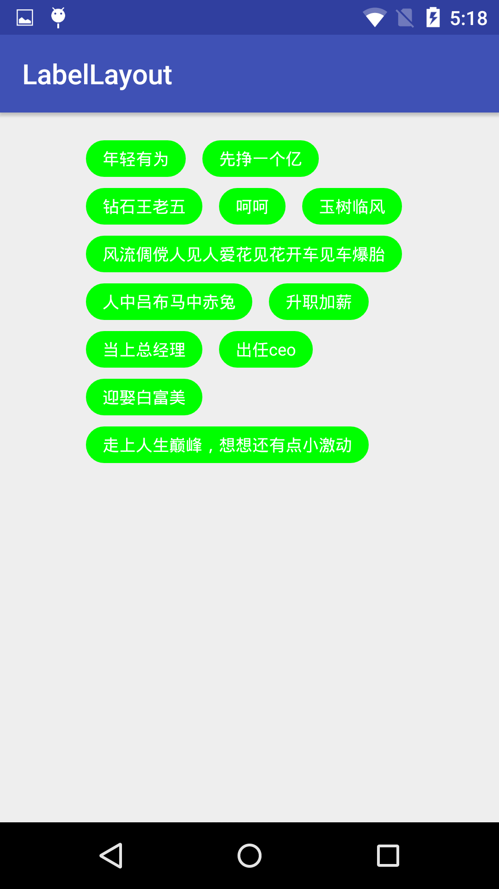

# LabelLayout
[](https://www.apache.org/licenses/LICENSE-2.0)
[ ](https://bintray.com/keviny-mob/maven/labellayout/_latestVersion)

自动换行控件

## 预览

center



left



## 1.用法
Android Studio使用依赖:
```java
compile 'cn.kevin:labellayout:1.0.0'

```

## 2.功能
 * 自动换行，可实现，对齐方式： 左、中、右。

## 3.属性

<table>
  <tdead>
    <tr>
      <th align="center">自定义属性</th>
      <th align="center">含义</th>
    </tr>
  </tdead>
  <tbody>
    <tr>
      <td align="center">label_gravity</td>
      <td align="center">对齐方式, 居左：left，局中：center，居右：right</td>
    </tr>
     </tbody>
</table>

## 4.代码演示 也可参考demo中的代码

### 1.在布局文件中加入LabelLayout
```xml
<LinearLayout xmlns:android="http://schemas.android.com/apk/res/android"
    xmlns:app="http://schemas.android.com/apk/res-auto"
    android:id="@+id/activity_main"
    android:layout_width="match_parent"
    android:layout_height="wrap_content"
    android:orientation="vertical">
    <cn.kevin.labellayout.LabelLayout
        android:id="@+id/label_layout"
        android:layout_marginLeft="40dp"
        app:label_gravity="center"
        android:layout_marginRight="40dp"
        android:layout_width="match_parent"
        android:layout_height="wrap_content"/>
</LinearLayout>
```

### 2.定义自己的标签View
``` xml
<TextView xmlns:android="http://schemas.android.com/apk/res/android"
    android:textSize="12sp"
    android:background="@drawable/corner_shape"
    android:layout_width="wrap_content"
    android:layout_height="wrap_content"
    android:paddingLeft="12dp"
    android:paddingTop="5dp"
    android:textColor="#FFFFFF"
    android:paddingRight="12dp"
    android:maxLines="1"
    android:ellipsize="end"
    android:layout_marginLeft="6dp"
    android:layout_marginTop="4dp"
    android:layout_marginRight="6dp"
    android:layout_marginBottom="4dp"
    android:paddingBottom="5dp">
</TextView>
```

### 3.实现LabelAdapter
```java
class TextLabelAdapter extends LabelAdapter<String> {
        public TextLabelAdapter(List<String> models) {
            super(models);
        }
        @Override
        public void onDataSet(View labelView, String item) {
            ((TextView)labelView).setText(item);
        }

        @Override
        public View getLabelView(ViewGroup parent) {
            return LayoutInflater.from(DemoActivity.this).inflate(R.layout.label, parent, false);
        }
    }
```

### 4.设置数据适配器
```java
        labelLayout = (LabelLayout) findViewById(R.id.label_layout);
        List<String> list = new ArrayList<>();
        list.add("升职加薪");
        list.add("当上总经理");
        list.add("出任ceo");
        list.add("迎娶白富美");
        list.add("走上人生巅峰，想想还有点小激动");
        TextLabelAdapter adapter = new TextLabelAdapter(list);
        labelLayout.setAdapter(adapter);
```
